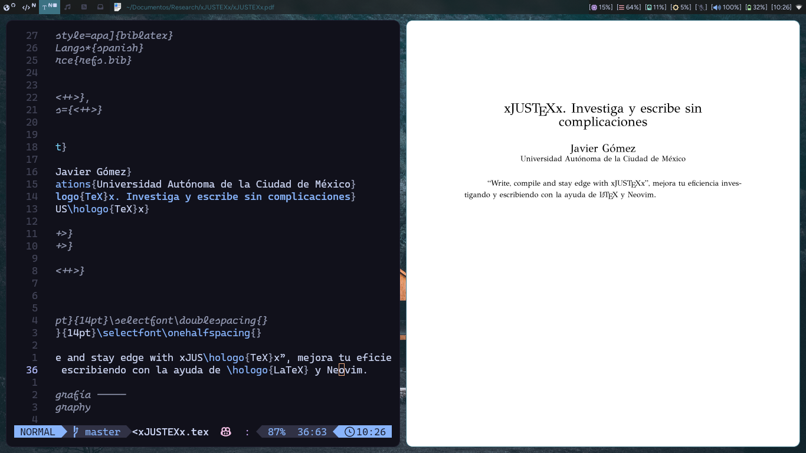
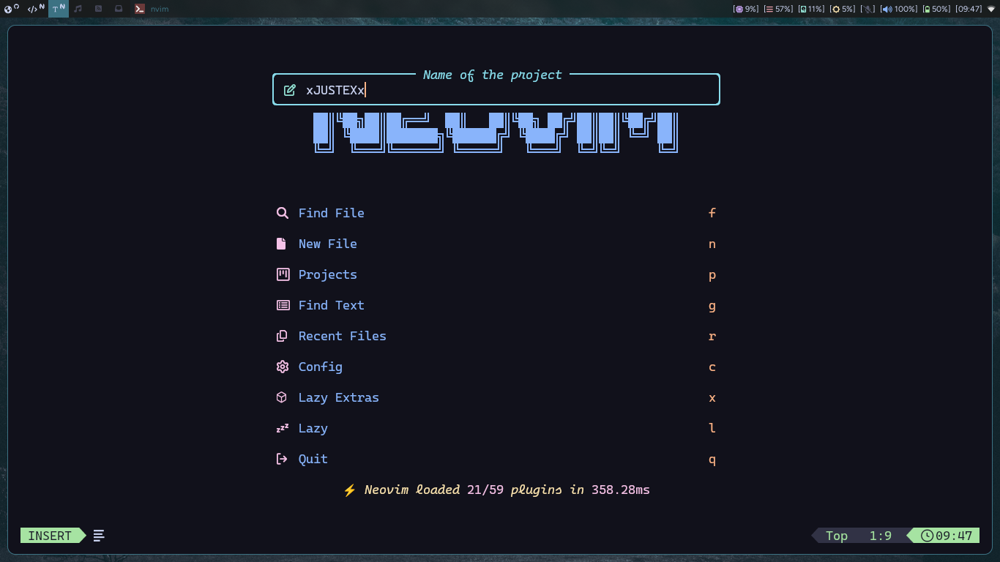
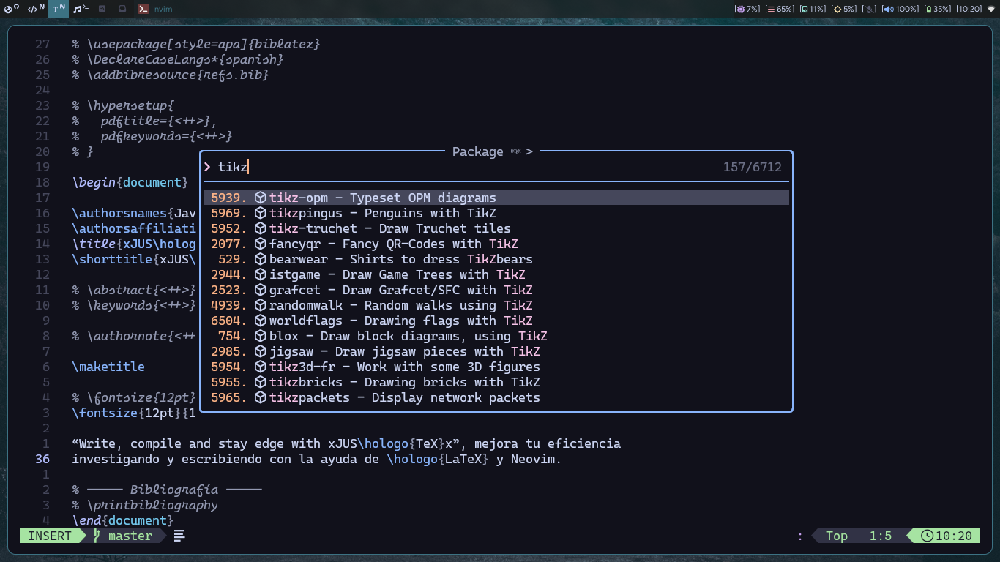
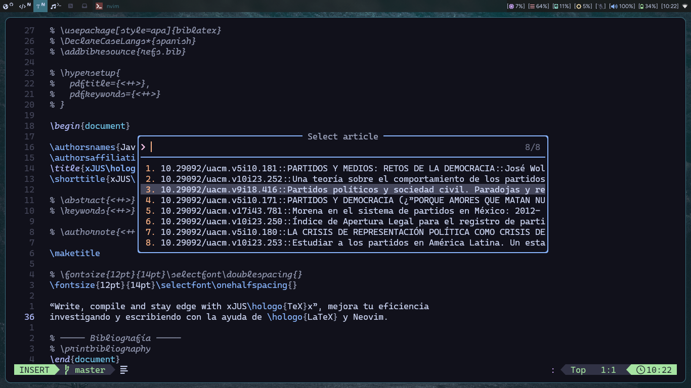

# xNVTEXx



xNVTEXx es un plugin moderno y sin dependencias, diseñado para optimizar la creación y compilación de documentos LaTeX de forma nativa dentro de Neovim. Elimina la necesidad de ejecutores de tareas externos, proporcionando un ecosistema totalmente integrado, impulsado por Lua para administrar, compilar y depurar flujos de trabajo LaTeX sin problemas.

Características principales:

- Compilación asincrónica nativa: compila documentos de forma asincrónica
  usando `vim.system`, proporcionando información sobre el progreso en tiempo
  real a través de `nvim_echo`.
- Autocompletado dinámico de comandos: finalización inteligente de la barra de
  comandos que se adapta dinámicamente tanto a los motores predeterminados como
  a los comandos personalizados definidos por el usuario.
- Detección inteligente de raíz y proyecto: recorrido automático del árbol
  para localizar el archivo maestro `.tex` y la raíz del proyecto desde
  cualquier búfer profundamente anidado.
- Integración perfecta del visor de PDF: compatibilidad inmediata con Zathura y
  Sioyek con búsqueda directa automatizada de SyncTex.
- Análisis de log avanzado: diagnóstico de ventana flotante que analiza salidas
  de registros de LaTeX desordenadas en texto legible para humanos a través de
  `pplatex`.
- Búsqueda de referencias y documentación: integración directa con motores de
  búsqueda bibliográfica (Open Library / CrossRef) y búsquedas de documentación
  CTAN.

xNVTEXx is a modern, zero-dependency plugin designed to streamline LaTeX
document creation and compilation natively within Neovim. It eliminates the
need for external task runners, providing a fully integrated Lua-driven
ecosystem to manage, compile, and debug LaTeX workflows seamlessly.

Main Features:

- Native Asynchronous Compilation: Compiles documents asynchronously using
  `vim.system`, providing real-time progress feedback via `nvim_echo`.
- Dynamic Command Auto-completion: Intelligent command bar completion that
  adapts dynamically to both default engines and user-defined custom commands.
- Smart Root & Project Detection: Automatic tree traversal to locate the master
  `.tex` file and project root from any deeply nested buffer.
- Seamless PDF Viewer Integration: Out-of-the-box support for Zathura and
  Sioyek featuring automated SyncTex forward search.
- Advanced Log Parsing: Floating window diagnostics that parse messy LaTeX
  log outputs into human-readable text via `pplatex`.
- Reference & Documentation Lookup: Direct integration with bibliographic
  search engines (Open Library / CrossRef) and CTAN documentation lookups.

## Tabla de Contenidos

- [Dependencias](#dependencias)
- [Instalación](#install)
- [Configuración](#configuration)
- [Uso](#use)
- [Opciones de Configuración](#change-default-configuration)
- [Contribuciones](#contribuciones)

## Dependencias

- Neovim >= 0.12
- Git
- Zathura
- Curl
- ¡Obviamente TeXlive!

## Install

Para instalar puedes usar el plugin manager que prefieras. El siguiente ejemplo
es con [lazy.nvim](https://github.com/folke/lazy.nvim).

To install you can use the plugin manager you prefer. The following example is
with [lazy.nvim](https://github.com/folke/lazy.nvim).

```lua
{
  "frvnzj/xNVTEXx.nvim",
  config = function()
    require("xNVTEXx").setup()
  end,
}

-- or if you are a noice.nvim user

{
  {
    "frvnzj/xNVTEXx.nvim",
    config = function()
      require("xNVTEXx").setup()
    end,
  },
  {
    "folke/noice.nvim",
    opts = {
      routes = {
        {
          filter = {
            event = "msg_show",
            kind = "progress",
          },
          view = "mini",
          opts = {
            replace = true,
          },
        },
      },
    },
  },
}

```

> 🗒️
> Para mostrar el progreso de la compilación usé nvim_echo().
> To show the build progress I used nvim_echo().

## Configuration

La configuración del plugin tiene cinco opciones:

- definición de los comandos para compilar LaTeX
- lista de directorios para crear los proyectos
- visualizador pdf con synctex
- plantillas o contenidos con el que se iniciará el main tex
- inclusión del archivo gitignore

The plugin configuration has five options:

- definition of the commands to compile LaTeX
- list of directories to create the projects
- pdf viewer with synctex
- templates or contents with which the main tex will be started
- inclusion of the gitignore file

---

Las opciones por default son las siguientes:

The default options are the following:

```lua
{
  commands = {
    lualatex = {
      "latexmk", "-lualatex", "-interaction=nonstopmode",
      "-synctex=-1", "{main_file}"
    },
    pdflatex = {
      "latexmk", "-pdf", "-interaction=nonstopmode",
      "-synctex=-1", "{main_file}"
    },
    xelatex = {
      "latexmk", "-pdfxe", "-interaction=nonstopmode",
      "-synctex=-1", "{main_file}"
    },
    cleanmain = { "latexmk", "-c", "{main_file}" },
    cleanall  = { "latexmk", "-c" },
  },
  project_dirs = {
    vim.fs.normalize("~/Documents/xNVTEXx/Articles"),
    vim.fs.normalize("~/Documents/xNVTEXx/Research"),
  },
  -- "zathura" or "sioyek" for synctex; you can use another one but it will not
  -- have synctex functionality available
  pdf_viewer = "zathura",
  tex_templates = {
    article = {
      name = 'Article',
      content = [[
\documentclass{article}


\begin{document}

\title{Title}
\author{Author}
\date{\today}
\maketitle


\section{Introduction}

This is an article template.


\end{document}
      ]],
    },
    book = {
      name = 'Book',
      content = [[
\documentclass{book}


\begin{document}

\title{Title}
\author{Author}
\date{\today}
\maketitle


\chapter{Introduction}

This is a book template.


\end{document}
      ]],
    },
    presentation = {
      name = 'Presentation',
      content = [[
\documentclass{beamer}


\begin{document}
\title{Title}
\author{Author}
\date{\today}
\frame{\titlepage}


\begin{frame}
\frametitle{Introduction}

This is a presentation template.

\end{frame}


\end{document}
      ]],
    },
  },
  gitignore = {
    enabled = true,
    content = [[
# LaTeX auxiliary files
*.aux
*.fdb_latexmk
*.fls
*.log
*.synctex.gz
*.synctex(busy)
*.synctex
*.run.xml
*.pdf
*.toc
*.nav
*.snm
*.out
*.bbl
*.bcf
*.blg

# Hidden files
.justfile

# Directorys
bibliography/

# Backup files
*~
*.bak
]],
  },
}
```

> ⚠️
> Para abrir el PDF compilado puedes establecer Zathura, Sioyek u otro vizor de
> PDF en la opción pdf_viewer; sin embargo, los comandos NVTexSearchCTAN y
> NVTexSearchJournal siguen dependiendo de Zathura para abrir PDF.

> ⚠️
> To open the compiled PDF you can set Zathura, Sioyek or another PDF viewer to
> the pdf_viewer option; however, the NVTexSearchCTAN and NVTexSearchJournal
> commands still rely on Zathura to open PDF.

## Use







xNVTEXx ofrece diez comandos:

- **NVTexNewProject**: crea un proyecto nuevo (directorio del proyecto,
  repositorio Git y tex file con el nombre del proyecto).

- **NVTexCompile**: compila utilizando optativamente LuaLaTeX, pdfLaTeX o
  XeLaTeX (dependiendo de tu `justfile_content`) con la ayuda/dependencia de
  [Just](https://github.com/casey/just).
  - `:NVTexCompile lualatex`
  - `:NVTexCompile pdflatex`
  - `:NVTexCompile pdfxe`
  - `:NVTexCompile cleanmain`
  - `:NVTexCompile cleanall`

- **NVTexCancelComp**: cancela la compilación cuando lo creas necesario.

- **NVTexOpenPDF**: abre el PDF del main file con zathura(default) o sioyek;
  si estás ubicado en un archivo dependiente del main file, también se abrirá el
  PDF del proyecto.

- **NVTexSearchCTAN**: enlista todos los paquetes de CTAN para buscar
  documentación. Los PDF's se abrirán en Zathura, la documentación HTMl en el
  navegador y los archivos de texto en Neovim, estos últimos se descargarán al
  caché, `stdpath('cache')`.

- **NVTexDoc**: abre la documentación del package bajo el cursor con el uso de
  texdoc.

- **NVTexLog**: abre el logfile para visualizar errores (requiere pplatex).

- **NVTexSearchBook**: busca referencias con ISBN y las añade al archivo
  refs.bib, que se creará automáticamente en el directorio raíz del proyecto, al
  confirmar la entrada.

  > ❕
  > Para buscar las referencias bibliográficas, el plugin hace uso del api de
  > Open Library, por lo que algunas referencias pueden no ser encontradas o
  > algunos campos pueden estar vacíos y tendrán que definirse manualmente. Por
  > ahora sólo busca referencias de libros.

- **NVTexSearchJournal**: busca referencias por medio de CrossRef, tiene mayor
  versatilidad este comando gracias a su API y por el mismo índice de revistas
  académicas.
  - **NVTexSearchJournal last_article**: con este subcomando podras abrir las
    opciones para el último artículo consultado.
  - **NVTexSearchJournal last_results**: con este subcomando podras consultar
    la última búsqueda de artículos.

  > ❕
  > Comienza por hacer la búsqueda de la revista académica, ya sea por palabras
  > clave o por el ISSN; después, busca artículos por palabras clave. Del
  > artículo seleccionado podrás agregar la referencia en formato biblatex en
  > el archivo refs.bib (se creará automáticamente), podrás abrir y descargar
  > el PDF del artículo en Zathura (es el único viewer configurado por ahora) o
  > descargar el EPUB. La accesibilidad a PDF's o EPUB's depende de la
  > disponibilidad de las revistas.

- **NVTexGitIgnore**: Si ya tienes un proyecto existente, este comando genera
  el archivo .gitignore, útil para ignorar los archivos auxiliares que genera
  LaTeX en la compilación y eliminar el ruido al controlar los cambios en el
  proyecto.

---

xNVTEXx offers ten commands:

- **NVTexNewProject**: Create a new project (Project Board, Git repository and
  Tex File with the name of the project).

- **NVTexCompile**: Compila using optionally LuaLaTeX, pdfLaTeX or XeLaTeX
  (depending on your `justfile_content`) with
  [Just's](https://github.com/casey/just) help.
  - `:NVTexCompile lualatex`
  - `:NVTexCompile pdflatex`
  - `:NVTexCompile pdfxe`
  - `:NVTexCompile cleanmain`
  - `:NVTexCompile cleanall`

- **NVTexCancelComp**: cancel the compilation when you think it is necessary.

- **NVTexOpenPDF**: open the PDF of the main file with zathura(default) or
  sioyek; If you are located in a file dependent on the main file, the PDF of the
  project will also open.

- **NVTexSearchCTAN**: List all CTAN packages to search for documentation. The
  PDF's will open in Zathura, the HTML documentation in the browser and the text
  files in Neovim, the latter will be downloaded to the cache, `stdpath
('cache')`.

- **NVTexDoc**: Open the Package documentation under the cursor with the use
  of Texdoc.

- **NVTexLog**: Open the logfile to visualize errors (requires pplatex).

- **NVTexSearchBook**: Look for references with ISBN and add them to the
  refs.bib file, which will be automatically created in the root directory of the
  project, confirming the entrance.

  > ❕
  > To look for bibliographic references, the plugin makes use of the Open
  > Library API, so some references may not be found or some fields may be
  > empty and will have to be defined manually. For now it only looks for book
  > references.

- **NVTexSearchJournal**: Look for references through Crossref, this command
  has greater versatility thanks to its API and the same index of academic
  journals.
  - **NVTexSearchJournal last_article**: with this subcommand you can open the
    options for the last article consulted.
  - **NVTexSearchJournal last_results**: with this subcommand you can consult
    the last article search.

  > ❕
  > Start by searching for the academic journal, either by keywords or by ISSN;
  > then search for articles by keywords. For the selected article you can add
  > the reference in biblatex format in the refs.bib file (it will be created
  > automatically), you can open and download the PDF of the article in Zathura
  > (it is the only viewer configured for now) or download the EPUB.
  > Accessibility to PDF's or EPUB's depends on the availability of the
  > journals.

- **NVTexGitIgnore**: If you already have an existing project, this command
  generates the .gitignore file, useful to ignore the auxiliary files that LaTeX
  generates in the compilation and eliminate noise when controlling changes in
  the project.

## Change default configuration


La configuración no se limita a las 3 opciones disponibles a modificar del
plugin. Por ejemplo, la configuración de uso personal para iniciar proyectos de
ensayo:

You can change the default configuration, for example, I set my own template
and directories:

```lua
require("xNVTEXx").setup({
  tex_templates = {
    article = {
      name = "Article",
      content = [[
\documentclass[doc,12pt]{apa7}

\usepackage{xJAVx-apa7}

\addbibresource{refs.bib}

% \hypersetup{
%  pdftitle={<++>},
%  pdfkeywords={<++>}
% }


\begin{document}

\authorsnames{<++>}
\authorsaffiliations{<++>}
\title{<++>}
\shorttitle{<++>}

% \abstract{<++>}
% \keywords{<++>}

% \authornote{<++>}

\maketitle

% \fontsize{12pt}{14pt}\selectfont\doublespacing{}
\fontsize{12pt}{14pt}\selectfont\onehalfspacing{}

<++>


% ----- Bibliografía -----
% \printbibliography
\end{document}]],
    },
  },
  project_dirs = {
    vim.fn.expand("$HOME") .. "/Documentos/Ensayos",
    "~/Documentos/Research",
    "/home/$USER/Documentos/Presentations"
  },
})
```

También puedes definir tu propia plantilla siguiendo la tabla de `tex_templates`:

Also you can define your own template following the table of `tex_templates`:

```lua
tex_templates = {
    myTemplate = {
        name = 'MyTemplate',
        content = [[
This is MyTemplate]],
    },
},
```

---


También es recomendable el uso de
[which-key](https://github.com/folke/which-key.nvim) o nvim_set_keymap() en
`ftplugin/tex.lua` y `ftplugin/plaintex.lua`, por ejemplo:

It is also recommended to use
[which-key](https://github.com/folke/which-key.nvim) or nvim_set_keymap() in
`ftplugin/tex.lua` y `ftplugin/plaintex.lua`, for example:

```lua
local function keymap(map, command, desc)
  vim.keymap.set("n", map, command, { silent = true, desc = desc })
end

keymap("<leader>aa", "<cmd>NVTexCompile lualatex<cr>", "xLUALATEXx")
keymap("<leader>acc", "<cmd>NVTexCompile pdflatex<cr>", "xLATEXx")
keymap("<leader>acx", "<cmd>NVTexCompile pdfxe<cr>", "xXELATEXx")
keymap("<leader>add", "<cmd>NVTexCompile cleanmain<cr>", "xCLEAN-MAINx")
keymap("<leader>ada", "<cmd>NVTexCompile cleanall<cr>", "xCLEAN-ALLx")
keymap("<leader>aq", "<cmd>NVTexCancelComp<cr>", "Cancel Comp")

keymap("<leader>ai", "<cmd>NVTexSearchBook<cr>", "NVTexISBN")
keymap("<leader>ajj", "<cmd>NVTexSearchJournal<cr>", "SEARCHxISSN")
keymap("<leader>aja", "<cmd>NVTexSearchJournal last_article<cr>", "lastXarticle")
keymap("<leader>ajs", "<cmd>NVTexSearchJournal last_results<cr>", "lastXresults")

keymap("<leader>am", "<cmd>NVTexSearchCTAN<cr>", "NVTexCTAN")
keymap("<leader>at", "<cmd>NVTexDoc<cr>", "NVTexTexdoc")

keymap("<leader>ao", "<cmd>NVTexLog<cr>", "NVTexLog")

keymap("<leader>az", "<cmd>NVTexOpenPDF<cr>", "NVTexPDF")
```

## Contribuciones

Si deseas contribuir mejorando el plugin o reportar errores, quedo atento.

### License MIT
